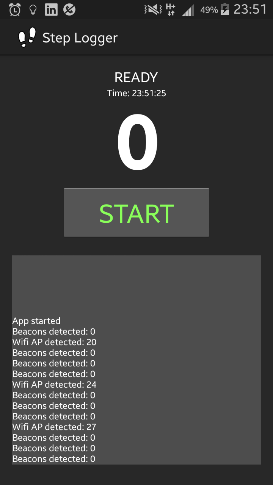

StepLogger
==========

An Android application (for both mobile and wearable devices) to generate indoor fingerprint maps containing:
* inertial and geomagnetic information
* detected Wi-Fi APs name and received signal strength indicator (RSSI)
* detected Bluetooth beacons name and RSSI

User Interface
--------------
Here is a screenshot of the user interface (for the mobile version):

Data produced
-------------
The app produces the following tables, formatted as a csv in the ``sdcard/logs/`` folder of the device:
* ``phone_<timestamp>_sens.txt``
* ``phone_<timestamp>_steps.txt``
* ``phone_<timestamp>_wifi.txt``
* ``phone_<timestamp>_beacons.txt``
